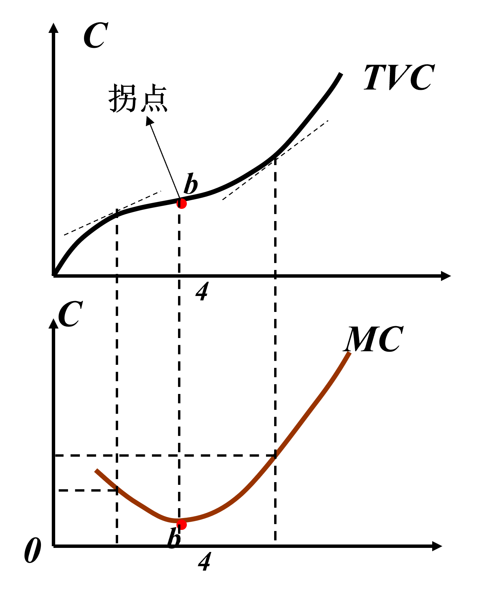
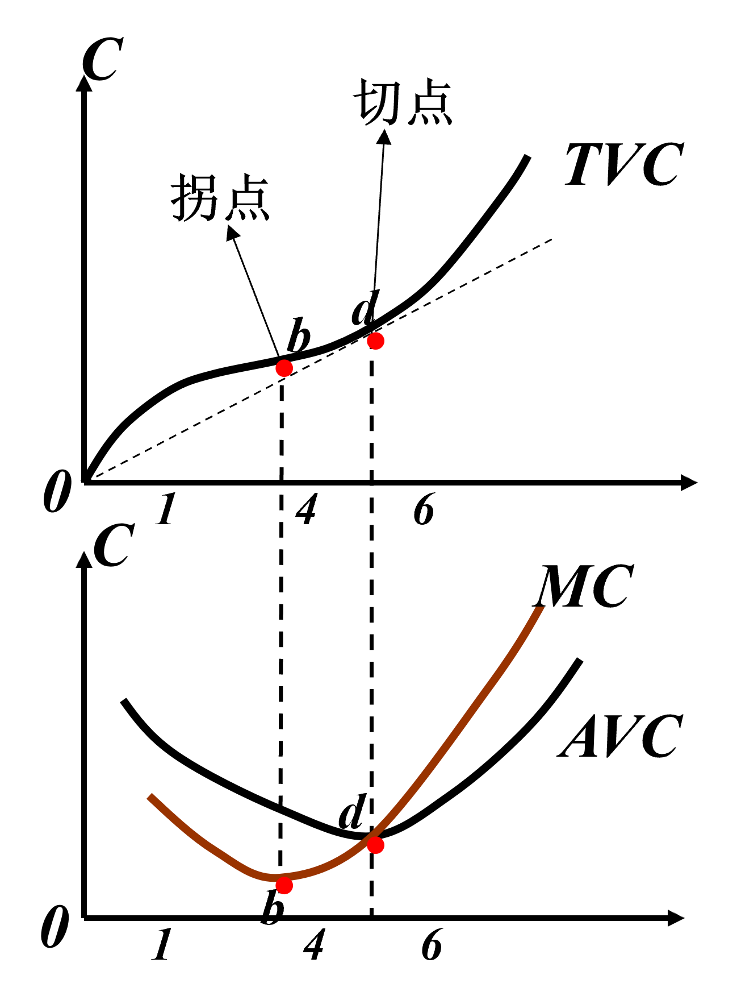
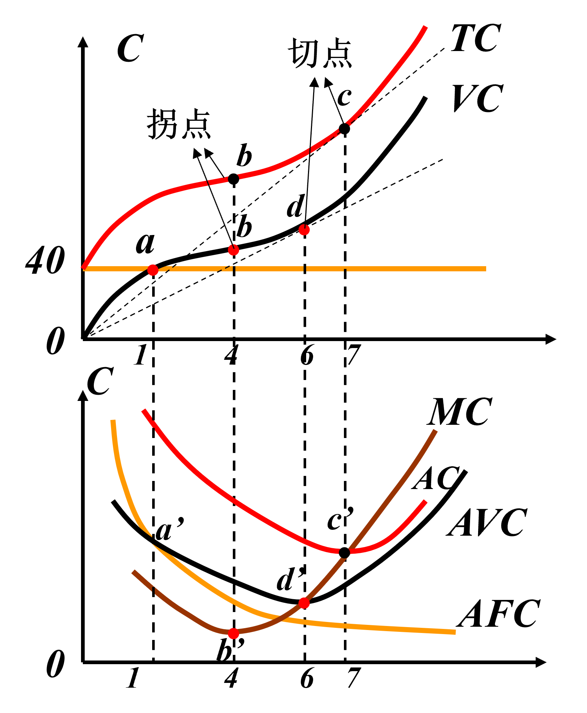
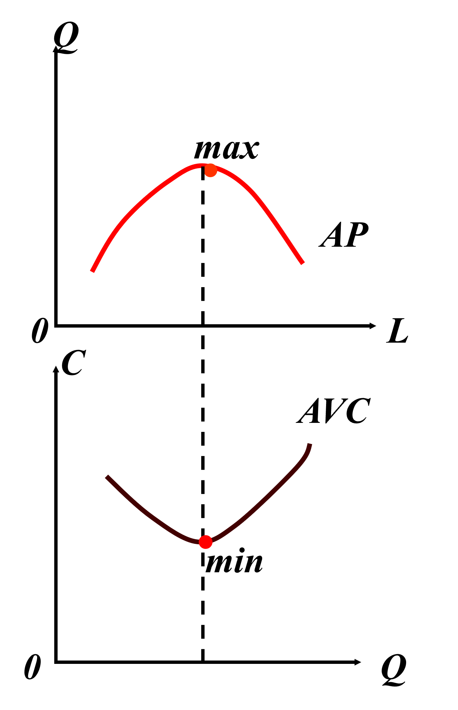
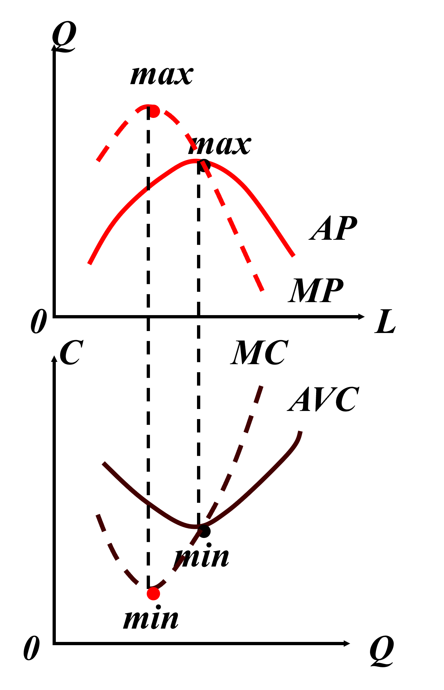
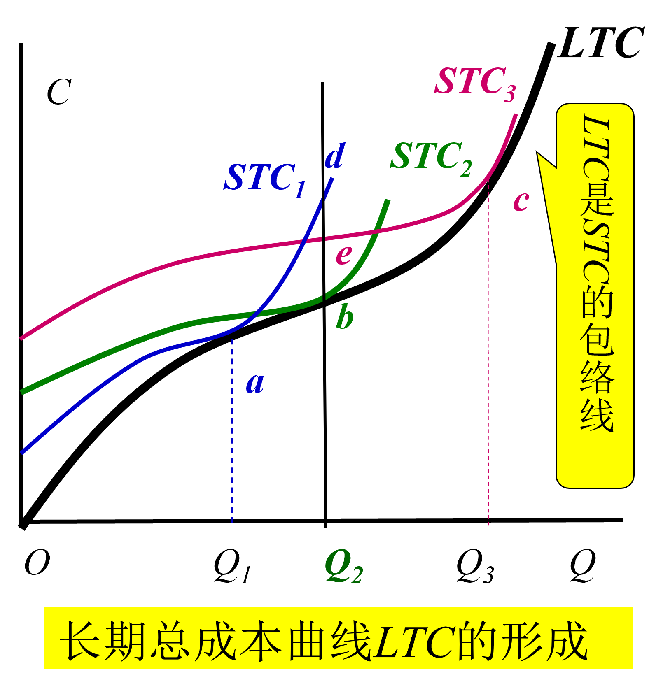
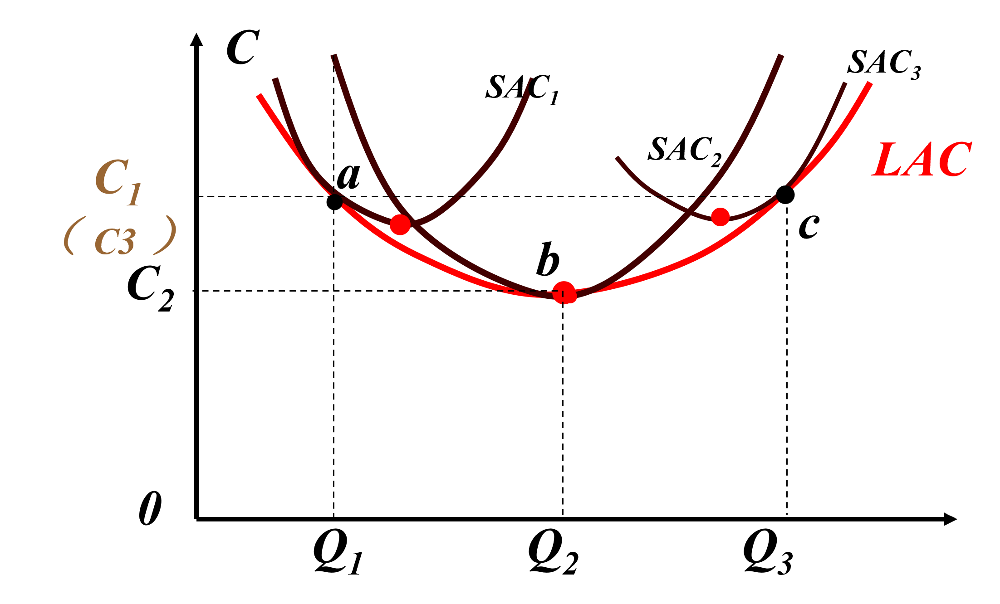
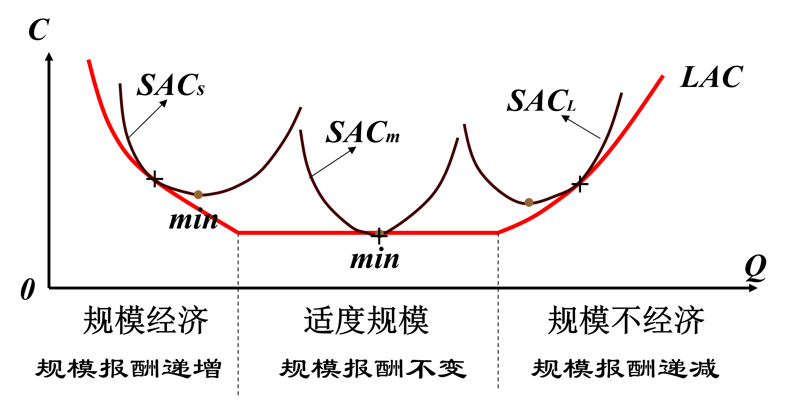
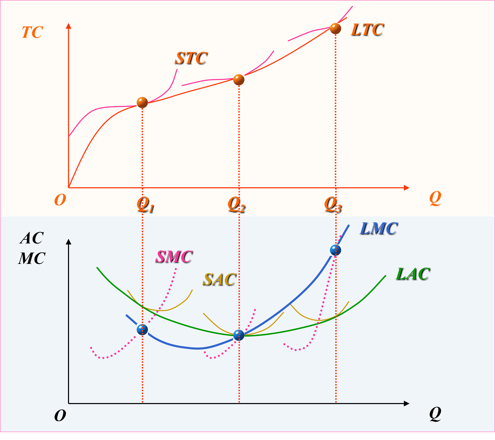
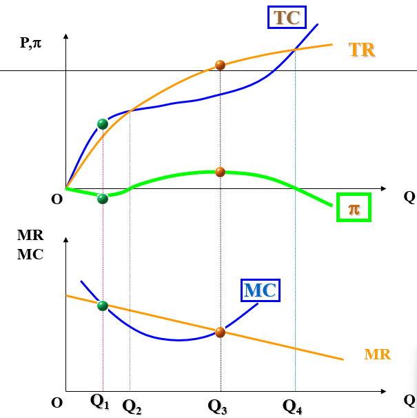

# 成本理论

成本是指为了生产商品或服务而支付的全部费用。成本理论在经济学中占有重要地位，因为它直接影响企业的生产决策和市场行为。

## 成本的分类
成本可以根据不同的标准进行分类，

## 经济成本，会计成本等。
1. **经济成本（Economic Costs）**：包括显性成本和隐性成本。显性成本是企业实际支付的费用，如工资、原材料费用等；隐性成本是企业放弃的其他机会的收益，如自有资本的机会成本。  
   $$EC = \text{显性成本} + \text{隐性成本}$$
2. **会计成本（Accounting Costs）**：仅包括显性成本，是企业在会计记录中反映的实际支出。  
   $$AC = \text{显性成本}$$
3. **机会成本（Opportunity Costs）**：选择一种资源配置方式所放弃的其他最佳选择的收益。  
   $$OC = \max(\text{其他选择的收益}) - \text{选择的收益}$$
4. **沉没成本（Sunk Costs）**：已经发生且无法收回的成本，不应影响未来的经济决策。  
如研发费用、市场调研费用等。
## 短期成本与长期成本
1. **短期成本（Short-Run Costs）**：在短期内，至少有一种生产要素是固定的，企业只能调整可变要素来改变产量。短期成本包括固定成本和可变成本。  
   $$STC = FC + SVC$$
2. **长期成本（Long-Run Costs）**：在长期内，所有生产要素都是可变的，企业可以调整所有要素来实现最优生产规模。长期成本曲线通常低于短期成本曲线，因为企业可以通过调整规模来降低平均成本。  
   $$
   LTC = LVC
   $$  

## 短期生产成本
1. **固定成本（FC）**：不随产量变化而变化的成本，如租金、设备折旧等。
2. **可变成本（VC）**：随产量变化而变化的成本，如原材料费用、劳动力成本等。
3. **总成本（TC）**：固定成本和可变成本之和
4. **边际成本（MC）**：增加一单位产量所增加的总成本。
5. **平均成本（AC）**：总成本除以产量，表示每单位产品的平均生产成本。

### 公式和计算
- $$STC = FC + VC$$
- $$VC = TC - FC$$
- $$MC = \frac{\Delta TC}{\Delta Q}$$
- $$AC = \frac{TC}{Q}$$
- $$AVC = \frac{VC}{Q}$$

### 成本曲线  
  

#### MC与TVC曲线
MC曲线对应于TVC曲线的拐点处达到最低点。 
当MC慢慢减少到最低点的时候，TVC的增速也变到最慢，之后MC开始上升，TVC的增速也开始加快。
  

#### MC与AVC曲线
当MC低于AVC时，AVC下降；当MC高于AVC时，AVC上升。因此，MC曲线与AVC曲线相交于AVC的最低点。

推导:  
$$
MC = \frac{d\,TVC}{dQ}
$$  

$$
AVC = \frac{TVC}{Q}
$$

$$
\frac{d\,AVC}{dQ} = \frac{Q \cdot \frac{d\,TVC}{dQ} - TVC}{Q^2}   
$$
$$
= \frac{MC \cdot Q - TVC}{Q^2} 
$$
$$
= \frac{MC}{Q} - \frac{AVC}{Q}
$$
当$MC = AVC$时，$\frac{d\,AVC}{dQ} = 0$，即AVC达到最低点，同时AVC穿过MC。

### 短期成本曲线簇
 

当$MC < AC$时,Q上升,AC下降。  
当$MC > AC$时,Q上升,AC上升。  
当$MC = AC$时,AC达到最低点。
当MC上升时，与AC相交于AC的最低点。

### 成本函数与生产函数的关系
成本函数与生产函数密切相关。生产函数描述了投入要素与产出之间的关系，而成本函数则反映了在不同产量水平下的总成本。
1. **生产函数（Production Function）**：表示在一定技术水平下，投入
要素与产出之间的关系。通常表示为：  
   $$ 
   Q = f(L, K)
   $$  
   其中，Q为产量，L为劳动投入，K为资本投入。
2. **成本函数（Cost Function）**：表示在不同产量水平下的总成本。通常表示为：
    $$
    TC = C(Q)
    $$  
    其中，TC为总成本，Q为产量。
通过生产函数，可以推导出成本函数，反之亦然。企业通过分析成本函数，可以优化资源配置，提高生产效率。  
根据生产函数，假设劳动和资本的价格为W和K
#### AVC与AP_L的关系
$$ AP_L = \frac{Q}{L} $$

$$ MP_L = \frac{dQ}{dL} $$

$$ AP_L = MP_L \cdot \frac{L}{Q} $$

$$
 AVC = \frac{VC}{Q} = \frac{WL}{Q} = \frac{W}{\frac{Q}{L}} = \frac{W}{AP_L}
$$  

由于边际报酬递减，$MP_L$随着劳动投入的增加而递减，$AP_L$也会递减。因此，$AVC$随着$L$的增加而递减，与$AP_L$成反比关系。在AP_L达到最大值时，$AVC$也达到最低点。

#### MC与MP_L的关系

$$
MC = \frac{d\,TC}{dQ} = \frac{d\,VC}{dQ} = \frac{d\,(W \cdot L)}{dQ} = W \cdot \frac{dL}{dQ} = W \cdot \frac{1}{MP_L}
$$
因此，$MC$与$MP_L$成反比关系。当$MP_L$增加时，$MC$减少；当$MP_L$减少时，$MC$增加。这表明，在边际报酬递减的情况下，增加劳动投入会导致边际成本上升。$MC$的最低点对应于$MP_L$的最大值。

  
### 长期成本曲线
长期成本曲线（LTC）表示在长期内，不同产量水平下的总成本。长期成本曲线通常低于短期成本曲线，因为企业可以调整所有生产要素来实现最优生产规模。
1. **长期总成本（LTC）**：在长期内，所有生产要素都是可变的，企业可以选择最优的生产规模来实现**最低成本**。  
   $$LTC = LFC + LVC$$
2. **长期平均成本（LAC）**：长期总成本除以产量，表示每单位产品的长期平均生产成本。表示厂商在长期内按产量平均计算的**最低成本**。  
   $$LAC = \frac{LTC}{Q}$$
3. **长期边际成本（LMC）**：增加一单位产量所增加的长期总成本。实际上是**最低**总成本的增量 
   $$LMC = \frac{d\,LTC}{dQ}$$
### 长期成本曲线的形状
长期成本曲线通常呈现U形，这反映了规模经济和规模不经济的影响。在低产量水平下，企业可以通过扩大生产规模来降低平均成本（规模经济）；然而，当产量继续增加时，管理复杂性和资源限制可能导致平均成本上升（规模不经济）。

### 长期成本曲线与短期成本曲线的关系
长期成本曲线是由一系列短期成本曲线的包络线形成的。每条短期成本曲线对应于不同的生产规模，而长期成本曲线则表示在所有可能的生产规模下的最低成本。

#### LTC与STC的关系
长期总成本（LTC）是短期总成本（STC）的下包络线。对于每一个产量水平，LTC表示在长期内实现该产量的最低成本，而STC则表示在特定生产规模下的成本。因此，LTC曲线始终位于STC曲线的下方或与之相切。
  

#### LAC与SAC的关系
长期平均成本（LAC）是短期平均成本（SAC）的下包络线。对于每一个产量水平，LAC表示在长期内实现该产量的最低平均成本，而SAC则表示在特定生产规模下的平均成本。因此，LAC曲线始终位于SAC曲线的下方或与之相切。

LAC与每一条SAC曲线仅有一个切点，切点对应的产量水平表示在该产量下，企业选择的最优生产规模，从而实现最低平均成本。  
除了切点外，LAC曲线低于所有SAC曲线，因为在长期内，企业可以调整生产规模以实现更低的平均成本。  
在LAC的最低点处，LAC曲线与一条SAC曲线相切，这表明在该产量水平下，企业的最优生产规模实现了最低的长期平均成本。  
在LAC最低点左边，LAC切于SAC最低点左边。  
在LAC最低点右边，LAC切于SAC最低点右边。

### LAC与生产规模的关系
长期平均成本（LAC）曲线的形状反映了生产规模对单位成本的影响。LAC曲线通常呈现U形，这表明在不同的生产规模下，单位成本会经历下降和上升的过程。
1. **规模经济（Economies of Scale）**：在LAC曲线的下降阶段，随着产量的增加，单位成本下降。这是因为企业通过扩大生产规模，可以更有效地利用资源，分摊固定成本，并实现专业化生产，从而降低平均成本。
2. **规模不经济（Diseconomies of Scale）**：在LAC曲线的上升阶段，随着产量的增加，单位成本上升。这可能是由于管理复杂性增加、资源限制或其他因素导致的效率下降，从而使平均成本上升。
3. **规模报酬不变（Constant Returns to Scale）**：在LAC曲线的最低点，单位成本达到最低值，此时企业的生产规模最为优化，既没有规模经济也没有规模不经济。

#### LMC与SMC的关系  
在每个产量水平，LTC都与代表最优生产规模的STC相切，在切点的斜率相同，而斜率分别是LMC和SMC，在LTC与STC切点对应处，**LMC=SMC**。因此， LMC与SMC必然相交于一点
LMC与SMC的交点所对应的产量，既是LTC与STC切点所对应的产量，又是LAC与SAC切点所对应的产量。在这一点，满足下面的条件： 
- LTC = STC
- LMC = SMC
- LAC = SAC
在LAC最低点处，LMC = LAC = SAC = SMC。

### 收益与利润最大化

#### 收益
收益指企业通过销售商品或服务所获得的总收入。包括成本和利润。   
收益又分为总收益（TR）、平均收益（AR）和边际收益（MR）。
1. **总收益（Total Revenue, TR）**：企业通过销售商品或服务所获得的总收入。  
   $TR = P \times Q$  
   其中，P为价格，Q为销售数量。
2. **平均收益（Average Revenue, AR）**：总收益除以销售数量，表示每单位产品的平均收入。  
   $AR = \frac{TR}{Q} = P$
3. **边际收益（Marginal Revenue, MR）**：增加一单位销售数量所增加的总收益。  
   $MR = \frac{\Delta TR}{\Delta Q}$

#### 利润
利润是收益减去成本后的剩余部分。  
会计利润和经济利润是两种不同的利润概念。
1. **会计利润（Accounting Profit）**：总收益减去会计成本（显性成本）后的剩余部分。   
   $AP = TR - AC$
2. **经济利润（Economic Profit）**：总收益减去经济成本（显性成本和隐性成本）后的剩余部分。   
   $\pi(Q) = TR - EC$
#### 利润最大化条件
企业通过调整产量来实现利润最大化。利润最大化的条件是边际收益等于边际成本（MR = MC）。
1. 当MR > MC时，增加产量可以增加利润。 
2. 当MR < MC时，减少产量可以增加利润。
3. 当MR = MC时，利润达到最大值，此时企业实现了利润最大化。企业既不增加也不减少产量，而是保持当前产量水平，实现利润最大化。一般这个点是生产规模最优点。利润最大化原则也是亏损最小化原则。

#### 数学证明
设利润函数为$\pi(Q)$，则有：
$$
\pi(Q) = TR(Q) - TC(Q)
$$
为了找到利润最大化的产量水平，我们对利润函数求导：
$$
\frac{d\pi(Q)}{dQ} = \frac{dTR(Q)}{dQ} - \frac{dTC(Q)}{dQ} = MR - MC
$$
$$
\therefore, \text{当} MR = MC \text{时，} \frac{d\pi(Q)}{dQ} = 0 \text{, 实现利润最大化。}
$$
同时要保证二阶导数小于零，即：
$$
\frac{d^2\pi(Q)}{dQ^2} = \frac{dMR}{dQ} - \frac{dMC}{dQ} < 0
$$
$\pi''(Q) <0 $时，$\pi(Q)$为凸函数，在该点取得最大值。

### 练习题
7、已知生产函数为$Q=A^{\frac{1}{4}} L^{\frac{1}{4}} K^{\frac{1}{2}}$；各要素的价格分别为PA=1，PL=1，PK=2；假定厂商处于短期生产，且K=16，推导：该厂商短期生产的总成本函数和平均成本函数；总可变成本函数和平均可变成本函数；边际成本函数。

$$
\because K = 16 \\
\therefore Q = A^{\frac{1}{4}} L^{\frac{1}{4}} \cdot 4 \\
\therefore TC = A + L + 32 \\
\therefore FC = 32 \\
\therefore MP_L = Q'(L) = A^{\frac{1}{4}} \cdot \frac{1}{4} L^{-\frac{3}{4}} \cdot 4 = A^{\frac{1}{4}} L^{-\frac{3}{4}} \\
\therefore MP_A = Q'(A) = \frac{1}{4} A^{-\frac{3}{4}} L^{\frac{1}{4}} \cdot 4 = A^{-\frac{3}{4}} L^{\frac{1}{4}} \\
\because 在等产量曲线上， MP_L/P_L = MP_A/P_A  的时候成本最小, P_L=1, P_A=1 \\
\therefore MP_L = MP_A \\
\therefore A^{\frac{1}{4}} L^{-\frac{3}{4}} = A^{-\frac{3}{4}} L^{\frac{1}{4}} \\
\therefore A = L \\
\therefore Q = A^{\frac{1}{4}} \cdot A^{\frac{1}{4}} \cdot 4 = 4A^{\frac{1}{2}} \\\
\therefore A = \frac{Q^2}{16} \\
\because A = L \\
\therefore L = \frac{Q^2}{16} \\
\therefore TVC = A + L = \frac{Q^2}{16} + \frac{Q^2}{16} = \frac{Q^2}{8} \\
\therefore TC = TVC + FC = \frac{Q^2}{8}
   + 32 \\
\therefore AVC = \frac{TVC}{Q} = \frac{Q}{8} \\
\therefore AC = \frac{TC}{Q} = \frac{Q}{8} + \frac{32}{Q} \\
\therefore MC = \frac{dTC}{dQ} = \frac{Q}{4}
$$  
  
  
8、已知某厂商的生产函数为$Q=0.5L^{\frac{1}{3}}K^{\frac{2}{3}}$；当资本投入量$K=50$时资本的总价格为$500$；劳动的价格$PL=5$。求：  
（1）劳动的投入函数$L=L(Q)$。  
（2）总成本函数、平均成本函数和边际成本函数。  
（3）当产品的价格P=100时，厂商获得最大利润的产量和利润各是多少？  

(1)
$$
\because Q = 0.5L^{\frac{1}{3}}K^{\frac{2}{3}} \\
\therefore L^{\frac{1}{3}} = \frac{2Q}{K^{\frac{2}{3}}} \\
\because K = 50 \\
\therefore L^{\frac{1}{3}} = \frac{2Q}{50^{\frac{2}{3}}} \\
\therefore L = \left(\frac{2Q}{50^{\frac{2}{3}}}\right)^3 = \frac{8Q^3}{125000} \\
$$
(2)
$$
\because K = 50 时, PK = 500 \\
\therefore PK = \frac{500}{50} = 10 \\
\therefore TC = PL \cdot L + PK \cdot K = 5 \cdot \frac{8Q^3}{125000} + 10 \cdot 50 = \frac{40Q^3}{125000} + 500 = \frac{Q^3}{3125} + 500 \\
